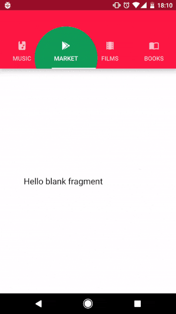
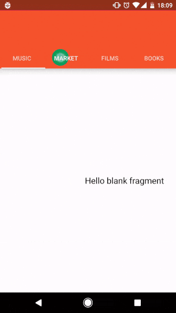

# PlayTabLayout

PlayTabLayout is a tab layout very similar to Google Play tab layout. The main feature is that ripple shows in a particular place where user taps.

<br/>


The current minSDK version is API level 16.

### Download
-----------------------

Gradle:
```groovy
implementation 'com.github.armcha:PlayTabLayout:1.2.4'
```

### Download sample [apk](https://github.com/armcha/PlayTabLayout/tree/master/art/app.apk)

## Setup and usage

1. Add AutoLinkTextView to your layout
```xml
     <io.armcha.playtablayout.core.PlayTabLayout
            android:id="@+id/playTabLayout"
            android:layout_width="match_parent"
            android:layout_height="some_dp" />
```

2. Add tab colors

```kotlin
playTabLayout.colors = intArrayOf(R.color.f,
                R.color.s,
                R.color.t,
                R.color.four)
```

### Note: array must be the same size as your adapter item count

3. And you can use it like a regular tab layout

```kotlin
viewPager.adapter = TabAdapter(supportFragmentManager)
val tabLayout = playTabLayout.tabLayout
tabLayout.setupWithViewPager(viewPager)
```

## Contact

Pull requests are more than welcome.

- **Email**: chatikyana@gmail.com
- **Facebook**: https://web.facebook.com/chatikyana
- **Twitter**: https://twitter.com/ArmanChatikyan
- **Google +**: https://plus.google.com/+ArmanChatikyan
- **Website**: https://armcha.github.io/
- **Medium**: https://medium.com/@chatikyan

License
--------

      PlayTabLayout
      Copyright (c) 2017 Arman Chatikyan (https://github.com/armcha/PlayTabLayout).

      Licensed under the Apache License, Version 2.0 (the "License");
      you may not use this file except in compliance with the License.
      You may obtain a copy of the License at

         http://www.apache.org/licenses/LICENSE-2.0

      Unless required by applicable law or agreed to in writing, software
      distributed under the License is distributed on an "AS IS" BASIS,
      WITHOUT WARRANTIES OR CONDITIONS OF ANY KIND, either express or implied.
      See the License for the specific language governing permissions and
      limitations under the License.
